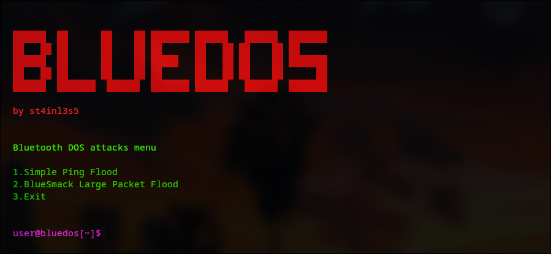
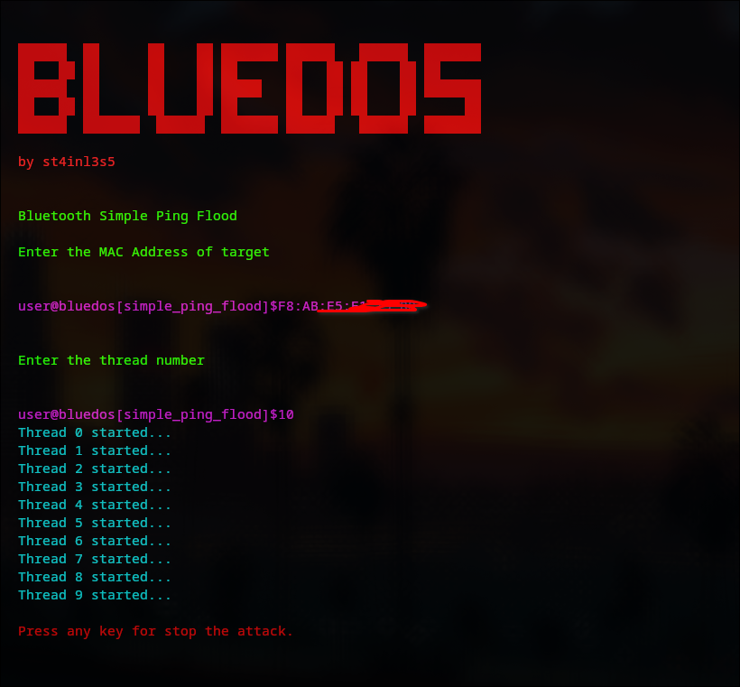

# bluedos
Bluetooth Denial Of Service(DOS) Attack Tool

## Requirements

+ python colorama (pip install colorama)

## Usage

+ sudo python bluedos.py

Enter the target device's MAC address and the number of threads to use

## Tested on

+ JBL Wave Beam
+ School's digital headcount (in progress)